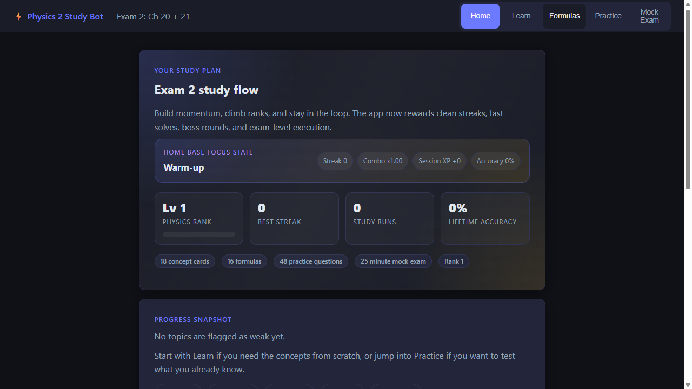
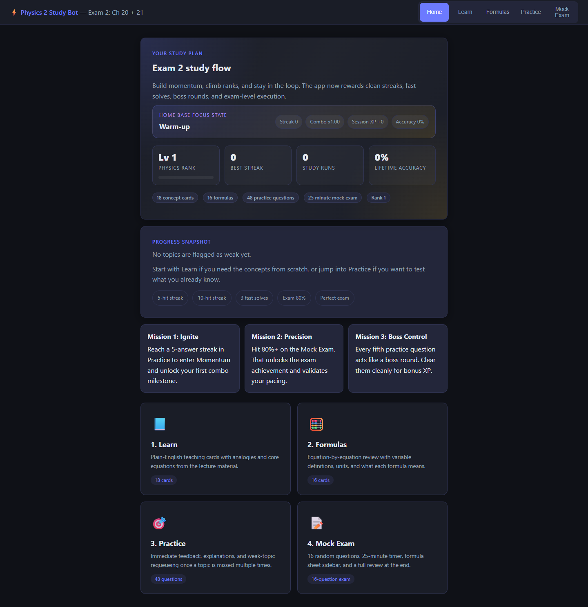
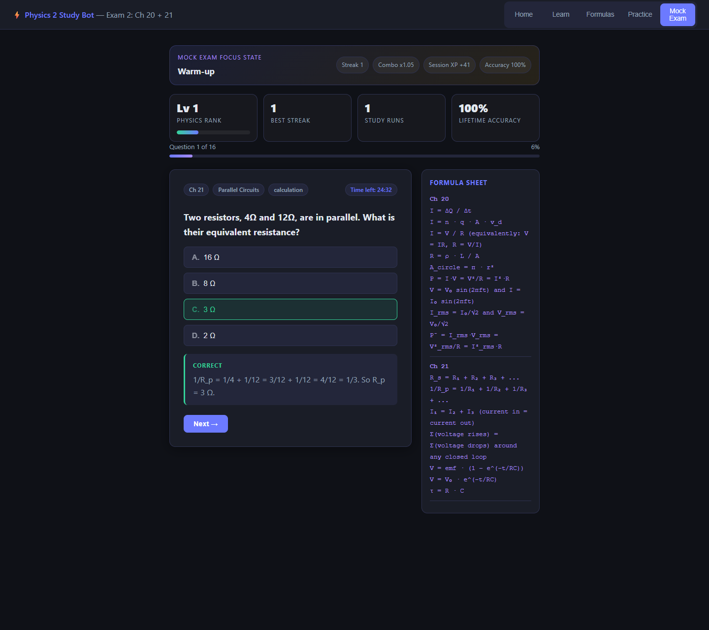

# Physics Study Bot

<p align="center">
  A single-file, gamified physics study app for circuits, current, Kirchhoff's rules, and RC circuits.
</p>

<p align="center">
  <a href="https://physics-study-bot.vercel.app"><strong>Live Demo</strong></a>
  |
  <a href="https://github.com/romanxmanuel/Physics-Study-Bot"><strong>GitHub Repo</strong></a>
</p>

<p align="center">
  
</p>

## Overview

Physics Study Bot is an interactive study app built to make high-pressure exam prep feel focused, fast, and genuinely engaging.

It teaches the material, drills weak spots, and keeps the user moving through a feedback loop of:

- learn the concept
- lock in the formula
- answer a question
- get immediate explanation
- build streaks and momentum
- simulate the real exam

The app runs entirely from a single `index.html` file with no framework, no build step, and no backend.

## Live Project

- Production: [physics-study-bot.vercel.app](https://physics-study-bot.vercel.app)

## Why This Project Matters

A lot of study tools are either static note dumps or heavy platforms that create friction before learning even starts. This project was built around a different goal:

- open instantly
- feel polished
- work offline
- explain hard topics clearly
- create enough challenge and progression to keep someone in flow

This turned into a hybrid of a study guide, practice engine, and lightweight game loop.

## Features

- `Learn` mode with plain-English explanations and intuitive analogies
- `Formulas` mode with equation breakdowns, units, and meaning
- `Practice` mode with instant feedback and topic reinforcement
- weak-topic tracking with requeue behavior after repeated misses
- `Mock Exam` mode with timer, formula sheet, and review screen
- persistent progression using XP, levels, streaks, and achievements
- responsive dark UI built for long study sessions

## Screenshots

### Home / Study Dashboard



### Mock Exam / Formula Sheet



## Technical Highlights

- pure `HTML`, `CSS`, and vanilla `JavaScript`
- single-file application architecture in `index.html`
- static deployment with no build command required
- state-driven rendering without any library abstraction
- local persistence through `localStorage`
- social preview metadata for clean link sharing on Vercel/GitHub

## Product Decisions

- kept the app single-file to minimize setup friction
- designed the interaction model around momentum, not just content display
- used gamification carefully so it supports learning instead of distracting from it
- made the deploy target static hosting so the project is easy to ship and maintain

## Project Structure

```text
Physics Study Bot/
|- assets/
|  |- exam-preview.png
|  |- home-preview.png
|  `- social-preview.png
|- index.html
|- write_html.mjs
|- extract_pptx.js
|- package.json
`- Relevent Training Material/   (ignored from Git)
```

## Running Locally

Open the app directly:

```bash
start index.html
```

Or serve it with a tiny local server:

```bash
python -m http.server 4173
```

Then visit `http://localhost:4173`.

## Deployment

This project is deployed as a static site on Vercel.

- framework preset: `Other`
- build command: none
- output directory: none

## Source Material

The app content was built from personal UCF Physics 2 study material covering:

- electric current
- Ohm's law
- resistance and resistivity
- power
- series and parallel circuits
- Kirchhoff's rules
- emf and internal resistance
- RC charging and discharging

The raw training files are intentionally excluded from the public repository.

## Future Improvements

- richer mastery analytics by chapter/topic
- reset-progress controls inside the app
- a broader question bank
- more deliberate motion and sound design
- expanded physics coverage beyond the current exam unit

## License

This project is released under the MIT License. See `LICENSE`.
